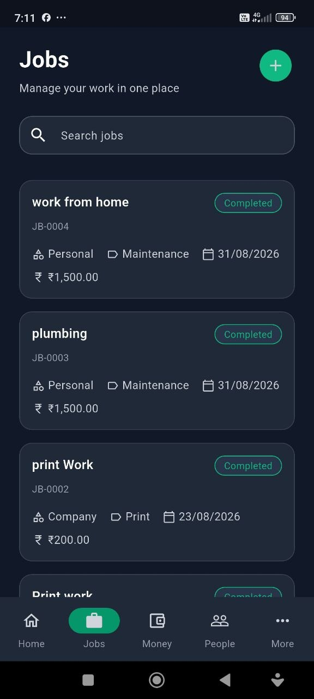

# Velora JobBook Showcase

An interactive product showcase for Velora JobBook — an offline-first business app for technicians and small contractors.

**[Explore the live showcase](https://velora-jobbook-showcase.netlify.app/)** · **[Product documentation](https://github.com/amithbaijuedakkalathur-cyber/velora-jobbook)** · **[Portfolio](https://amith-baiju.netlify.app/)**

The page includes existing application screenshots, interactive capability tabs, an animated workflow, and a screenshot lightbox. It is a permanent product presentation. The animated workflow illustrates the product; it does not execute JobBook transactions.

This repository contains only the showcase website. The commercial Velora JobBook application source code is not included.

## Run locally

Use Node.js 22.13 or newer and the committed lockfile:

```bash
npm ci
npm run dev
```

## Product preview



The six captures in `public/screens/` are used by the live page. They are interface evidence, not proof of business performance or successful test execution. Captures may represent different sessions; displayed totals should not be compared across screens.

## Technology and structure

- React and TypeScript implement presentation and interactions in `app/page.tsx`.
- Next.js supplies layout metadata and the static Netlify export.
- Tailwind/PostCSS and `app/globals.css` provide styling.
- Vinext, Vite and Cloudflare tooling support the original Sites preview/build path.
- `public/screens/` holds application captures; `public/og.png` is the social preview.
- `netlify.toml` defines the current Netlify build. `next.config.ts` enables static export only for Netlify.
- `.openai/hosting.json` is imported by `vite.config.ts`; its non-secret project identifier and required dependencies are retained.

## Checks and builds

```sh
npm run lint
npx tsc --noEmit
npm run build
NETLIFY=true npm run build:netlify
```

The last command uses POSIX shell syntax; in PowerShell set `$env:NETLIFY = 'true'` before `npm run build:netlify`. Netlify exports to `out/`. The Vinext build is the separate Sites/Cloudflare path. Google fonts are fetched during the Next.js build, so network access is required.

There is no automated application test suite here. CI checks lint, TypeScript and the static Netlify build; it does not test the commercial Android app. See [validation guidance](docs/VALIDATION.md).

## Product boundary and maintenance

[Velora JobBook](https://github.com/amithbaijuedakkalathur-cyber/velora-jobbook) documents the private commercial app and reported beta status. This repository builds only the website. Neither repository grants access to or an open-source license for the commercial app.

Read [SECURITY.md](SECURITY.md) before reporting a vulnerability or adding assets. A successful build alone does not establish security. Review screenshots for identifying records before publication; never commit credentials, backups or personal documents.

## Contact

[Amith Baiju E](https://amith-baiju.netlify.app/) · [LinkedIn](https://www.linkedin.com/in/amith-baiju/) · [Email](mailto:amithbaijuedakkalathur@gmail.com)
